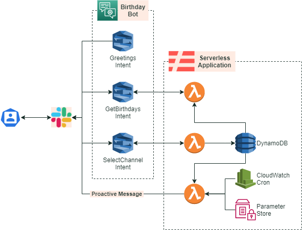

# Amazon-Lex-Happy-Birthday-Bot

This project aims to show you how to use AWS services to implement a proactive HappyBirthdayBot, integrating Amazon Lex as a conversational interface, Slack as a messaging channel, and BambooHR as a source of birthday dates.

Before start, these are some concept you might familiar with

+ [Amazon Lex](https://aws.amazon.com/lex/) is a service for building conversational interfaces into any application using voice and text.
+ [BambooHR](https://www.bamboohr.com/) is a technology company that provides human resources software as a service.
+ [Slack](https://slack.com/) is a communication platform developed by the software company Slack Technologies.

## How it works

## Architecture diagram

You can see the architecture that we used to make the birthday bot work in the following diagram:

## Prerequisites

- [AWS Account](https://aws.amazon.com/)
