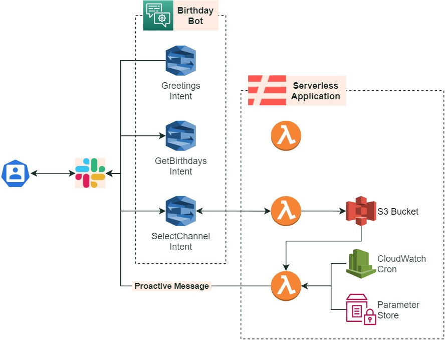

# Amazon-Lex-Happy-Birthday-Bot

This project aims to show you how to use AWS services to implement a proactive HappyBirthdayBot, integrating Amazon Lex as a conversational interface, Slack as a messaging channel, and BambooHR as a source of birthdates.

Before starting, these are some concept you might familiar with:

+ [Amazon Lex](https://aws.amazon.com/lex/) is a service for building conversational interfaces into any application using voice and text.
+ [BambooHR](https://www.bamboohr.com/) is a technology company that provides human resources software as a service.
+ [Slack](https://slack.com/) is a communication platform, mainly used by teams and enterprises.

## How it works

The Birthday Bot is an integration of AWS with Slack. Its logic is based on AWS Lambda functions and Lex.

The bot works in two ways:

- **Responding to a Slack conversation:** The AWS Lex bot has three intents configured, each of them has one lambda function behind. These intents allow the bot to greet, respond to the birthdays of the day, and configure the channel where proactive messages will be posted.

When the user configures the channel, the lambda function triggered by this intent writes on an S3 bucket file, storing the configured channel.

- **Sending proactive messages:** A Lambda function is triggered by EventBridge (CloudWatch Events). It reads the configured channel on the S3 file, the birthdays of the day, and post it to the channel. The authentication tokens for Slack are stored on Parameter Store inside [AWS Systems Manager](https://aws.amazon.com/systems-manager/).

## Architecture diagram

You can see the architecture, that we used to make the birthday bot work, in the following diagram:

## Prerequisites

- [AWS Account](https://aws.amazon.com/)

## Further reading

- [Create AWS Lex intents](https://docs.aws.amazon.com/lex/latest/dg/gs2-create-bot-intent.html)
- [Create AWS Lex Slot types](https://docs.aws.amazon.com/lex/latest/dg/gs2-create-bot-slot-types.html)
- [Using Lambda functions on AWS Lex](https://docs.aws.amazon.com/lex/latest/dg/using-lambda.html)
- [Secure strings on Parameter Store](https://docs.aws.amazon.com/es_es/systems-manager/latest/userguide/sysman-paramstore-securestring.html)
