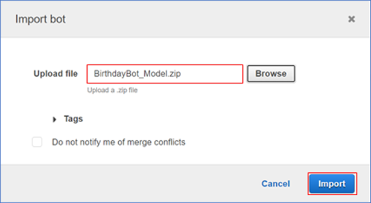
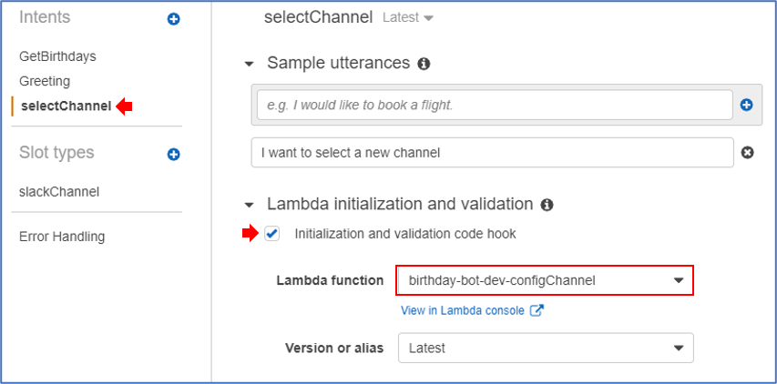
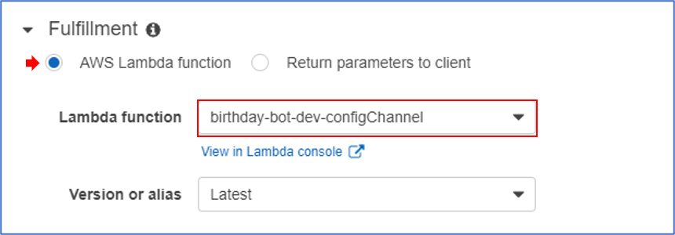
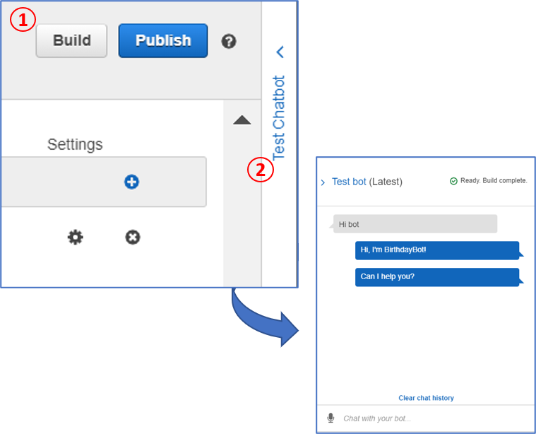
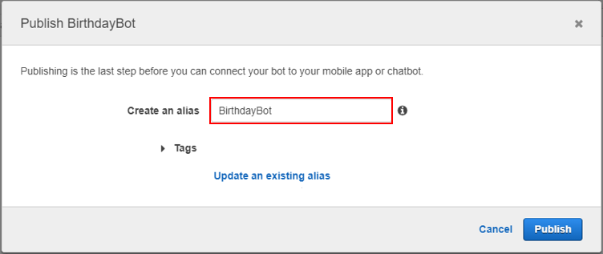
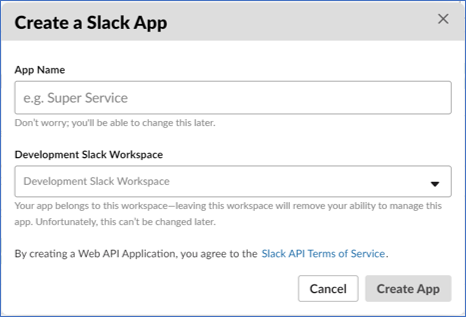
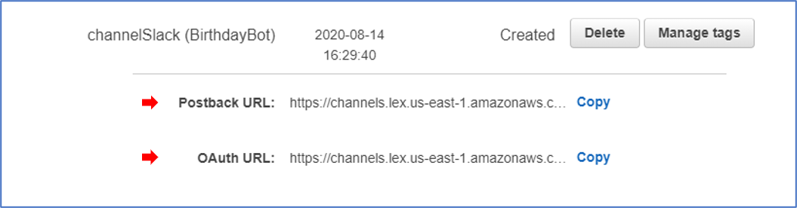

# Description


## Prerequisites

[AWS Account](https://aws.amazon.com/account/) 

Setup [Serverless](https://www.serverless.com/framework/docs/providers/aws/guide/intro/) to deploy the bot resources. You can configure it following this [guide](./setup-serveless.md)

[PowerShell](https://docs.microsoft.com/en-us/powershell/scripting/install/installing-powershell?view=powershell-7)


## Bot Setup Steps

> You need to setup and deploy the resources using [Serverless](https://www.serverless.com/framework/docs/providers/aws/guide/intro/) before configure the AWS Lex service. You can configure it following this [guide](./setup-serveless.md)


### Create Amazon Lex Bot

1. Got to the **models** directory, open a PowerShell terminal and run the next command. 

   ```powershell
   Compress-Archive -Path . -DestinationPath ./BirthdayBot_Model.zip
   ```

2. Open the [Amazon Lex console]( https://console.aws.amazon.com/lex/), click on **cancel** to avoid the bot creation wizard.

3. On the **Bots** page, choose **Action**, select **Import**.

4. In the **Import Bot** dialog, browse to the **models** directory, select the **BirthdayBot_Model.zip** and click on **import**. Accept the **overwrite** confirmation dialog.

   

   

5. Open the **BirthdayBot**, for the **GetBirthdays** and **SelectChannel** intents.

   1. In the **Lambda initialization and validation** section

   2. Mark the **code hook** checkbox.

   3. Choose the **Lambda function** for the Intent. Accept the **Add permission to Lambda Function** dialog. 

      Lambdas functions will have a name related with the intent

      Intent: **GetBirthdays** => Lambda function: **birthday-bot-dev-getBirthdays**

      Intent: **selectChannel** => Lambda function: **birthday-bot-dev-configChannel**

      

   4. In the **Fulfillment** section, choose the **Lambda function** for the Intent. Make sure you have the Latest version. 

      

   5. Click on **Save Intent**

6. On the up right corner, Click on **Build**. Then **Test Chatbot**

   

   7. On the up right corner, Click on **Publish**, enter the alias and publish the bot. 

      


### Connect with Slack

In order to link our bot to Slack, we have to create an application on the Slack side

1. Go to [create a Slack application](https://api.slack.com/apps) channel, and create a new slack application.

   

2. In the **Basic Information** page. Record the following **App Credentials:**

- - Client ID
  - Client Secret
  - Verification Token

3. Open the [Amazon Lex console]( https://console.aws.amazon.com/lex/), click on your **BirthdayBot**.

4. Go to **Channels**, select **Slack** and provide the following information. Then, click on **Activate**

   - - **Channel Name**: Type name for the channel
     - **Channel Description**: Type description for the channel 
     - **KMS key**: select default, `aws/lex`
     - **Alias**: Bot alias create when publish the bot
     - **Client Id**: Recorded from Slack
     - **Client secret**: Recorded from Slack
     - **Verification Token**: Recorded from Slack

   The console will create the bot channel association and returns the **Postback URL** and **OAuth** URLs.  

   

   Record them in order to update your **Slack application** configuration to use these endpoints as follows:

   - The **Postback URL** is the Amazon Lex bot's endpoint that listens to Slack events. You use this URL:

      - As the request URL in the **Event Subscriptions** feature of the Slack application.
- To replace the placeholder value for the request URL in the **Interactive Messages** feature of the Slack application.
   - The **OAuth URL** is your Amazon Lex bot's endpoint for an OAuth handshake with Slack.

5. Go back to the [Slack API console](https://api.slack.com/apps) and choose the app previously created on **step 1**.

6. Update the **OAuth & Permissions** feature as follows:

7. 1. In the left menu, choose **OAuth & Permissions**.
   2. In the **Redirect URLs** section, add the OAuth URL that Amazon Lex provided in the previous step. Choose **Add a new Redirect URL**, and then choose **Save URLs**.
   3. In the **Bot Token Scopes** section, add two permissions with the **Add an OAuth Scope** button. Filter the list with the following text:

- - `chat:write`
  - `team:read`

7. Update the **Interactivity & Shortcuts** feature by updating the **Request URL** value to the Postback URL that Amazon Lex provided in the preceding step. Enter the postback URL that you saved in step 4, and then choose **Save Changes**.

8. Subscribe to the **Event Subscriptions** feature as follows:

- - Enable events by choosing the **On** option.
  - Set the **Request URL** value to the Postback URL that Amazon Lex provided in the preceding step.
  - In the **Subscribe to Bot Events** section, subscribe to the `message.im` bot event to enable direct messaging between the end user and the Slack bot.
  - Save the changes.

9. Choose **Manage Distribution** under **Settings**. Choose **Add to Slack** to install the application. Authorize the bot to respond to messages.
10. In slack app go to **Direct Messages** section, choose your bot and send messages related to the configured intents.


### Further reading

- [Create AWS Lex custom bot](https://docs.aws.amazon.com/lex/latest/dg/getting-started-ex2.html)
- [AWS Lex bot and Slack integration](https://docs.aws.amazon.com/lex/latest/dg/slack-bot-association.html)

