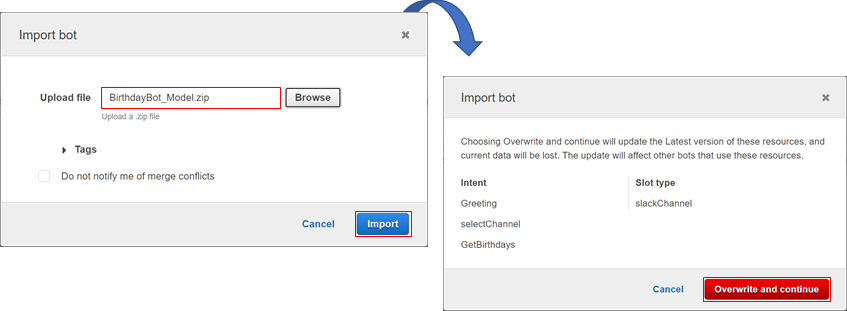

### Index

1. [Deploy serverless application](./serverless.md)
2. **Set up the Lex bot**
3. [Set up Slack App and connect with Lex](./slack.md)

### Import Amazon Lex Bot

1. Got to the **models** directory, open a PowerShell terminal and run the next command.

   ```powershell
   Compress-Archive -Path . -DestinationPath ./BirthdayBot_Model.zip
   ```

2. Open the [Amazon Lex console](https://console.aws.amazon.com/lex/), click on **cancel** to avoid the bot creation wizard.

3. On the **Bots** page, choose **Action**, select **Import**.

4. In the **Import Bot** dialog, browse to the **models** directory, select the **BirthdayBot_Model.zip** and click on **import**.

   

   (Optional) In case you already have a resource with the same name, you will see a confirmation dialog to **overwrite** it. Be careful and check twice before clicking on **overwrite and continue**.

   

5. Open the **BirthdayBot**, for the **GetBirthdays** and **SelectChannel** intents.

   1. In the **Fulfillment** section, choose the **Lambda function** related to the **Intent** and Accept the **Add permission to Lambda Function** dialog. Make sure you have selected the Latest version of the function.

      Lambdas functions will have a name related with the intent

      Intent: **GetBirthdays** => Lambda function: **birthday-bot-dev-getBirthdays**

      Intent: **selectChannel** => Lambda function: **birthday-bot-dev-configChannel**

      

   2. Click on **Save Intent**

6. On the up right corner, Click on **Build**. Then, click on **Test Chatbot** to test the bot.

   

7. On the up right corner, Click on **Publish**, enter the alias and publish the bot.

   

[<- Deploy serverless application](./serverless.md) | [Set up Slack App and connect with Lex ->](./slack.md)

### Further reading

- [Create AWS Lex custom bot](https://docs.aws.amazon.com/lex/latest/dg/getting-started-ex2.html)