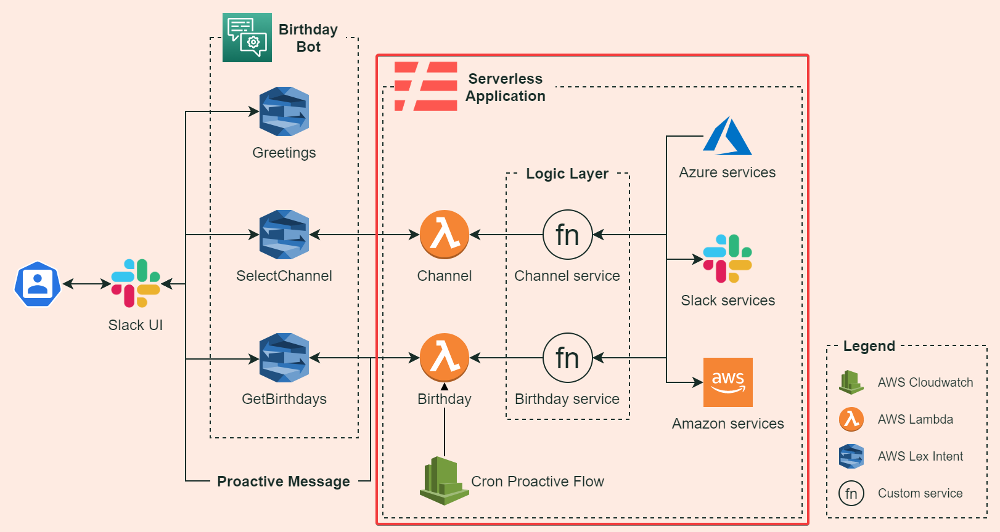
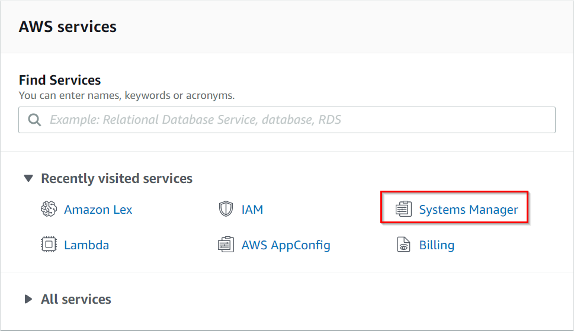
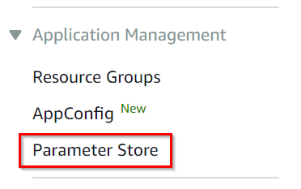
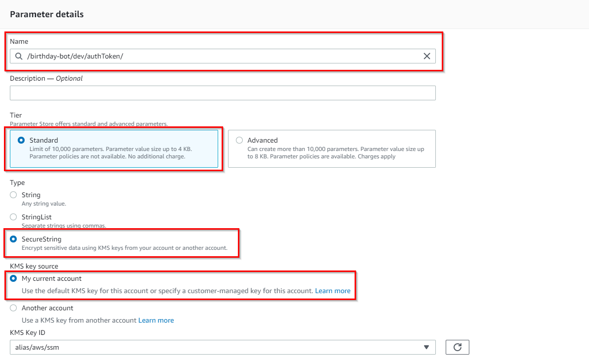
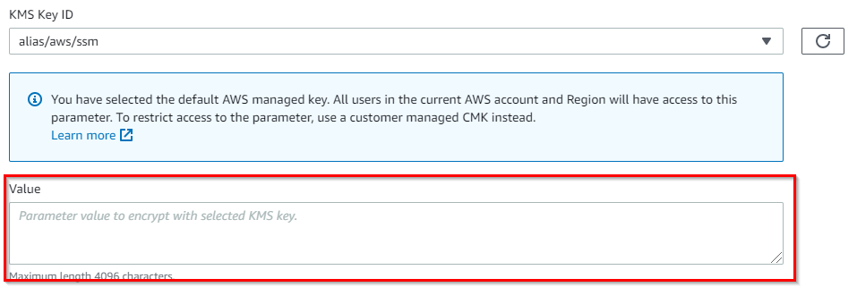

### Index

1. **Deploy serverless application**
2. [Set up the Lex bot](./lex-bot.md)
3. [Set up Slack App and connect with Lex](./slack.md)

# Serverless application

[Serverless Framework](https://www.serverless.com/open-source/) is an open source framework to manage serverless applications, this allows you to develop, deploy, and test locally the app, making the development process easier.

It has many [examples](https://www.serverless.com/examples/) in different languages for various cloud platforms. Also has useful features, some of these are:

- You can [manage multiple stages](https://www.serverless.com/framework/docs/providers/aws/cli-reference/deploy#deployment-with-stage-and-region-options), deploying the service with the flag `--stage`.
- You can easily [test locally](https://www.serverless.com/framework/docs/providers/aws/cli-reference/invoke-local/) the Lambda functions.
- You can [configure in a YAML file](https://www.serverless.com/framework/docs/providers/aws/guide/serverless.yml/) the [events ](https://www.serverless.com/framework/docs/providers/aws/guide/events/)which trigger your functions and create related AWS [resources](https://www.serverless.com/framework/docs/providers/aws/guide/resources/).
- The deploy process compresses your functions and creates CloudFormation stack files with all the preconfigured services, and deploys it to the cloud.
- You can integrate it and automate a CI/CD process with many tools like [Jenkins](https://www.jenkins.io/) or [CircleCI](https://circleci.com/).

## How it works

We use the Serverless Framework to simplify our development and deployment of the solution.

We implemented the Lambda functions and also the other resources needed like the Cron job, S3 bucket, and Parameter Store.

This not include the Lex service configuration because the implementation of it would be complex from Serverless.

## Architecture diagram

You can see the architecture defined in the serverless application in the following diagram:



## To create parameter store

1. Open the [Amazon console](https://console.aws.amazon.com/lex/), enter your user account.

2. Click on System Manager.



3. Click on Parameter Store on the left sidebar.



4. At the top right click on `Create parameter`
5. At this step you should set a name, select Standard Tier and select SecureString



6. Finally set up token in the `Value` field as shown below:



## To run this project

1. Install **Serverless Framework**. Open a terminal, and run the next command:

   ```bash
   npm install -g serverless
   ```

   _(For alternative ways of installation see_ [_this_](https://www.serverless.com/framework/docs/getting-started/)_)_

2. Configure your **AWS credentials** as follow:

   ```bash
   serverless config credentials --provider aws --key <your-key> --secret <your-secret>
   ```

   _(For more detailed information about how to get the AWS key and secret, see_ [_this_](https://www.serverless.com/framework/docs/providers/aws/guide/credentials/)_)_

3. Go to the **birthday-bot** directory and run the next command.

   ```bash
   serverless deploy
   ```

   _The default value of the_ `--stage` _flag is_ `dev`_. You can choose whatever stage you want to deploy the app, like `prod`. This parameter will be added to the name of each resource to recognize it._

   > **Environment Variables**
   >
   > The environment variables are in `env.yml`.
   >
   > For development set them `env.dev.yml`.

[<- Index](../birthday-bot/README.md) | [Set up the Lex bot ->](./lex-bot.md)

## Further reading

- [Serverless CLI Reference for AWS](https://www.serverless.com/framework/docs/providers/aws/cli-reference/)
- [AWS Lambda](https://aws.amazon.com/es/lambda/)
- [AWS S3 ](https://aws.amazon.com/es/s3/)
- [AWS CloudWatch cronjobs](https://docs.aws.amazon.com/AmazonCloudWatch/latest/events/ScheduledEvents.html)
- [AWS Parameter Store](https://docs.aws.amazon.com/systems-manager/latest/userguide/systems-manager-parameter-store.html)
