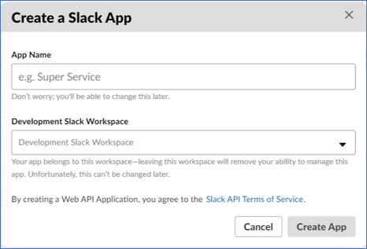
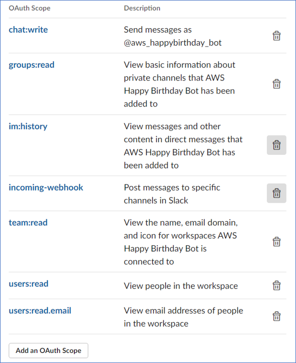
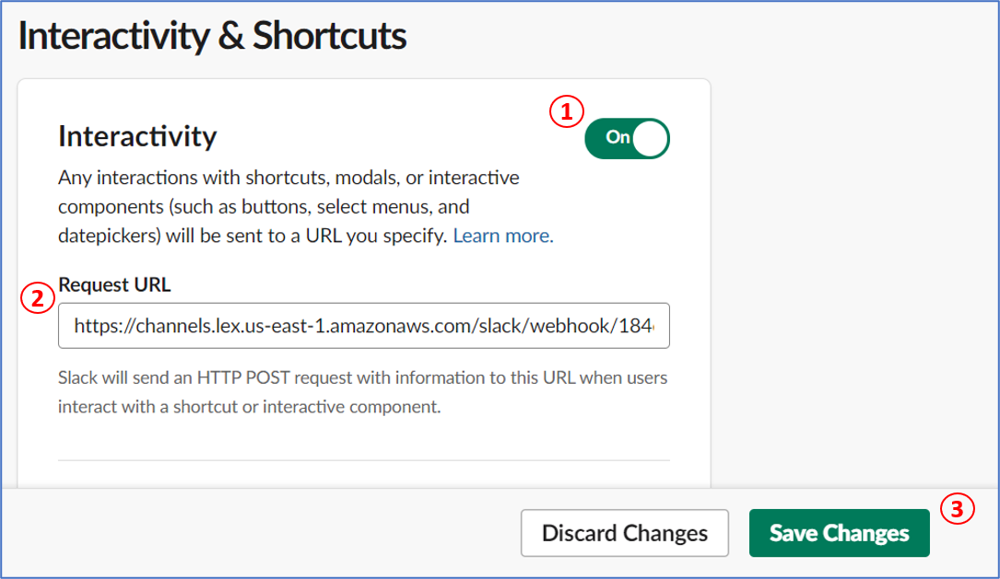
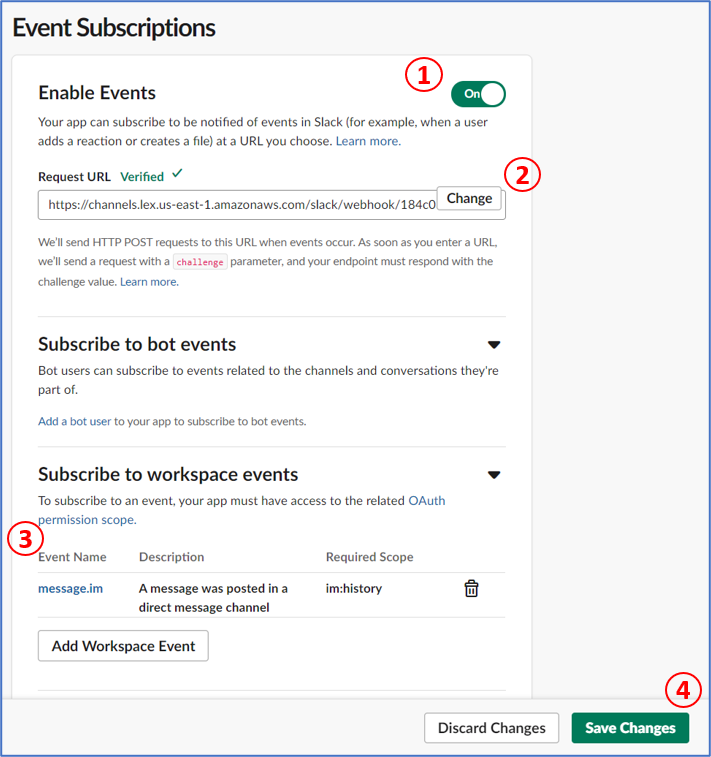

### Index

1. [Deploy serverless application](./serverless.md)
2. [Set up the Lex bot](./lex-bot.md)
3. [Set up Slack](./slack.md)

### Connect with Slack

In order to link our bot to Slack, we have to create an application on the Slack side

1. Go to [create a Slack application](https://api.slack.com/apps) channel, and create a new slack application.

   

2. In the **Basic Information** page. Record the following **App Credentials:**

   - Client ID
   - Client Secret
   - Verification Token

3. Open the [Amazon Lex console](https://console.aws.amazon.com/lex/), click on your **BirthdayBot**.

4. Go to **Channels**, select **Slack** and provide the following information. Then, click on **Activate**

   - **Channel Name**: Type name for the channel
   - **Channel Description**: Type description for the channel
   - **KMS key**: select default, `aws/lex`
   - **Alias**: Bot alias create when publish the bot
   - **Client Id**: Recorded from Slack
   - **Client secret**: Recorded from Slack
   - **Verification Token**: Recorded from Slack

   The console will create the bot channel association and returns the **Postback URL** and **OAuth** URLs.

   

   Record them in order to update your **Slack application** configuration to use these endpoints as follows:

   - The **Postback URL** is the Amazon Lex bot's endpoint that listens to Slack events. You use this URL:

     - As the request URL in the **Event Subscriptions** feature of the Slack application.
     - To replace the placeholder value for the request URL in the **Interactive Messages** feature of the Slack application.

   - The **OAuth URL** is your Amazon Lex bot's endpoint for an OAuth handshake with Slack.

5. Go back to the [Slack API console](https://api.slack.com/apps) and choose the app previously created on **step 1**.

6. In the left menu, choose **OAuth & Permissions**.

7. In the **Redirect URLs** section, add the **OAuth URL** that Amazon Lex provided in the previous step, click on **Add**. Then **Save URLs**

   

8. In the **Scopes** section, click on **Add an OAuth Scope** button, add the next permissions:

   - `chat:write`
   - `groups:read`
   - `im:history`
   - `incoming-webhook`
   - `team:read`
   - `users:read`
   - `users:read.email`

   

9. In the left menu, choose **Interactivity & Shortcuts**.

   1. Turn Interactivity **On**
   2. Enter the **Postback URL** that you saved in step 4.
   3. Then, click on **Save Changes**

      

10. In the left menu, choose **Event Subscriptions**.

    1. Turn the **Enable Events** On

    2. Set the **Request URL** value to the Postback URL that Amazon Lex provided in the step 4.

    3. In the **Subscribe to workspace events** section, subscribe to the `message.im` bot event to enable direct messaging between the end user and the Slack bot.

    4. Click on **Save Changes**

       

11. In the left menu, choose **Manage Distribution**, click on **Add to Slack** to install the application. Authorize the bot to respond to messages.

12. In slack app go to **Direct Messages** section, choose your bot and send messages related to the configured intents.

### Further reading

- [AWS Lex bot and Slack integration](https://docs.aws.amazon.com/lex/latest/dg/slack-bot-association.html)